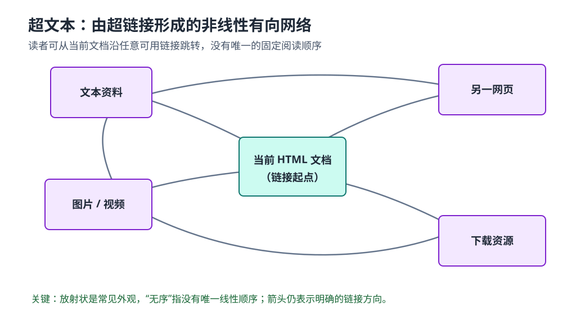

# 第二章 应用层

> 颜色标记：<span style="background:#f3e8ff;color:#6b21a8;padding:2px 6px;border-radius:4px;">淡紫色：同类名称</span> <span style="background:#ccfbf1;color:#155e75;padding:2px 6px;border-radius:4px;">淡青色：专有名词</span> <span style="background:#fee2e2;color:#991b1b;padding:2px 6px;border-radius:4px;">淡红色：重点 / 易错</span> <span style="background:#dcfce7;color:#166534;padding:2px 6px;border-radius:4px;">绿色：解释 / 作用</span>

## 1. 创建网络应用

### 1.1 网络应用运行在哪里

<span style="background:#ccfbf1;color:#155e75;padding:2px 6px;border-radius:4px;">网络应用</span>：运行在不同端系统上的应用进程通过网络交换报文，共同完成某种应用功能。

常见网络应用包括 Web、电子邮件、即时通信、在线游戏、流媒体视频和文件共享等。

创建网络应用，主要是在<span style="background:#fee2e2;color:#991b1b;padding:2px 6px;border-radius:4px;">端系统上编写和运行应用程序</span>，让分布在不同主机上的进程借助传输层服务通信。

以 Web 为例：浏览器进程与 Web 服务器进程分别运行在不同端系统上，按照 HTTP 规则交换请求与响应报文。

### 1.2 为什么网络核心不运行应用层软件

- 网络应用通常只部署在端系统，不要求沿途路由器理解具体应用。
- 网络核心主要负责分组的路由与转发，不处理网页、邮件等应用语义。
- 新应用一般只需更新通信两端的软件，无需改造所有核心路由器。

<span style="background:#dcfce7;color:#166534;padding:2px 6px;border-radius:4px;">作用</span>：这种“核心简单、边缘智能”的设计便于快速开发和部署新应用。

<span style="background:#fee2e2;color:#991b1b;padding:2px 6px;border-radius:4px;">易错</span>：“网络核心没有应用层功能”是对普通分组转发路径的概括，不表示核心网络中绝不可能部署 DNS、缓存或安全检测等中间服务。

## 2. 网络应用的体系结构

<span style="background:#ccfbf1;color:#155e75;padding:2px 6px;border-radius:4px;">应用体系结构</span>描述应用进程分别运行在哪里，以及这些进程以什么角色和关系通信。

常见分类：客户端-服务器模式（C/S）、对等模式（P2P）、C/S 与 P2P 的混合模式。

### 2.1 客户端-服务器模式（C/S）

<span style="background:#ccfbf1;color:#155e75;padding:2px 6px;border-radius:4px;">客户端-服务器模式（Client/Server，C/S）</span>：由服务器持续提供服务，客户端主动向服务器发起通信。

#### 服务器特点

- 通常持续运行，以便随时接收请求。
- 通常具有稳定、可被客户端找到的地址；服务使用约定或公开的端口号。
- 可通过服务器集群、数据中心和负载均衡扩展处理能力。
- 单台服务器直接扩展能力有限，集中式服务可能形成瓶颈或单点故障。

#### 客户端特点

- 主动向服务器发起通信。
- 可能间歇上线，IP 地址也可能动态变化。
- 传统 C/S 模式下，客户端通常不直接与其他客户端通信。

<span style="background:#fee2e2;color:#991b1b;padding:2px 6px;border-radius:4px;">易错</span>：服务器不一定只有一台物理机器；实际服务常由服务器集群共同提供。服务器地址也不一定永久不变，关键是能通过域名或服务发现机制被客户端找到。

### 2.2 对等模式（P2P）

<span style="background:#ccfbf1;color:#155e75;padding:2px 6px;border-radius:4px;">对等模式（Peer-to-Peer，P2P）</span>：对等节点可以直接通信，每个节点既可能请求服务，也可能向其他节点提供服务。

- 通常没有一个承担全部业务且必须持续运行的中心服务器。
- 任意对等节点之间可以直接交换数据。
- 每个节点在不同通信中可以分别充当客户端或服务器。
- 新节点带来请求的同时，也可能贡献上传带宽、存储或计算能力，具有<span style="background:#dcfce7;color:#166534;padding:2px 6px;border-radius:4px;">自扩展性</span>。
- 节点可能间歇上线、地址变化，管理、发现、安全与稳定性更复杂。

历史示例：Gnutella；迅雷等软件也曾采用或结合 P2P 技术。

<span style="background:#fee2e2;color:#991b1b;padding:2px 6px;border-radius:4px;">易错</span>：P2P 不等于“完全没有服务器”。登录认证、节点发现、资源索引或协调功能仍可能依赖服务器。

### 2.3 C/S 与 P2P 的混合模式

<span style="background:#ccfbf1;color:#155e75;padding:2px 6px;border-radius:4px;">混合模式</span>：使用中心服务器完成索引、登录、发现或协调，再由节点之间直接传输数据。

#### Napster 的典型机制

1. 节点向中心服务器登记自己拥有的文件资源。
2. 查询者向中心服务器查询资源所在节点。
3. 实际文件在两个对等节点之间直接传输。

其中，<span style="background:#f3e8ff;color:#6b21a8;padding:2px 6px;border-radius:4px;">资源搜索采用 C/S</span>，<span style="background:#f3e8ff;color:#6b21a8;padding:2px 6px;border-radius:4px;">文件传输采用 P2P</span>。

#### 即时通信的典型机制

1. 用户上线后向中心服务器登记在线状态和可达信息。
2. 用户通过中心服务器查找好友的在线状态或位置。
3. 两个用户可以直接通信，也可能由服务器中继，取决于系统设计和网络环境。

<span style="background:#fee2e2;color:#991b1b;padding:2px 6px;border-radius:4px;">易错</span>：课件中的“两个用户之间聊天：P2P”是教学简化。现实系统常因 NAT、防火墙、安全审计或离线消息需求而通过服务器中继。

### 2.4 三种体系结构对比

| 对比项 | C/S | P2P | 混合模式 |
| --- | --- | --- | --- |
| 组织方式 | 客户端请求，服务器响应 | 对等节点直接交换数据 | 中心协调，节点直接或经服务器通信 |
| 中心节点 | 通常依赖 | 核心传输通常不完全依赖 | 部分功能依赖 |
| 节点角色 | 客户端与服务器较固定 | 节点可同时请求和提供服务 | 随具体功能变化 |
| 扩展方式 | 增加服务器资源 | 节点可贡献资源，具有自扩展性 | 中心服务与对等资源共同扩展 |
| 主要难点 | 服务器瓶颈、单点故障 | 节点发现、管理、安全、稳定性 | 设计复杂，中心组件仍可能成为瓶颈 |

## 3. 进程通信

### 3.1 进程与报文

<span style="background:#ccfbf1;color:#155e75;padding:2px 6px;border-radius:4px;">进程（process）</span>：在主机上运行的程序实例，是网络应用实际参与通信的主体。

- 同一主机内的进程通常使用操作系统提供的进程间通信（IPC）机制。
- 不同主机上的进程通过网络交换<span style="background:#ccfbf1;color:#155e75;padding:2px 6px;border-radius:4px;">报文（message）</span>通信。
- 应用进程调用操作系统提供的网络 API，使用传输层服务收发报文。
- 报文交换必须遵守应用层协议规定的格式、含义、顺序和处理动作。

### 3.2 客户端进程与服务器进程

| 进程角色 | 判定标准 |
| --- | --- |
| <span style="background:#f3e8ff;color:#6b21a8;padding:2px 6px;border-radius:4px;">客户端进程</span> | 主动发起通信的进程 |
| <span style="background:#f3e8ff;color:#6b21a8;padding:2px 6px;border-radius:4px;">服务器进程</span> | 等待其他进程联系并提供服务的进程 |

<span style="background:#fee2e2;color:#991b1b;padding:2px 6px;border-radius:4px;">易混</span>：客户端/服务器既可以描述应用体系结构，也可以描述一次通信中的进程角色。P2P 应用中仍然存在客户端进程和服务器进程，只是角色不固定在某类主机上。

## 4. 分布式进程通信要解决的问题

### 4.1 问题一：如何标识和寻址进程

仅有 IP 地址只能定位主机，不能唯一定位主机中的某个应用进程，因为一台主机可以同时运行多个网络进程。

| 寻址信息 | 作用 |
| --- | --- |
| IP 地址 | 定位目标主机或网络接口 |
| 传输层协议 | 指明使用 TCP、UDP 等哪种传输服务 |
| 端口号 | 在目标主机内区分应用进程或服务 |

<span style="background:#ccfbf1;color:#155e75;padding:2px 6px;border-radius:4px;">端点（endpoint）</span>通常可用“IP 地址 + 端口号”描述；若需要完整消除歧义，还要结合传输层协议。

```text
应用通信的一端 = 传输层协议 + IP 地址 + 端口号

一条 TCP 连接由以下四项共同标识：
源 IP 地址 + 源端口号 + 目的 IP 地址 + 目的端口号
```

<span style="background:#fee2e2;color:#991b1b;padding:2px 6px;border-radius:4px;">易错</span>：IP 地址标识主机或接口，端口号用于区分主机中的进程或服务；不能只用 IP 地址唯一标识一个进程。

### 4.2 常见服务端口

| 应用协议 | 传输层协议 | 常用端口 | 作用 |
| --- | --- | --- | --- |
| HTTP | TCP | 80 | 明文 Web 服务 |
| HTTPS | TCP | 443 | 基于 TLS 的 Web 服务；HTTP/3 通常使用 UDP 443 |
| SMTP | TCP | 25 | 邮件服务器之间传输邮件 |
| FTP | TCP | 21 | FTP 控制连接；主动模式数据连接传统上使用 TCP 20 |

<span style="background:#fee2e2;color:#991b1b;padding:2px 6px;border-radius:4px;">[纠错]</span>：课件照片中的 `ftp: TCP 2` 是截断或笔误，FTP 控制连接的知名端口是 TCP 21。

<span style="background:#dcfce7;color:#166534;padding:2px 6px;border-radius:4px;">说明</span>：知名端口是默认约定，不表示协议只能使用该端口；服务可以配置为其他端口。

### 4.3 问题二：传输层怎样向应用层提供服务

<span style="background:#ccfbf1;color:#155e75;padding:2px 6px;border-radius:4px;">Socket（套接字）</span>：应用进程使用传输层服务的编程接口和通信端点抽象。应用把数据交给 Socket，操作系统再通过传输层及下层协议完成发送；接收方向相反。

- 从层间关系看，Socket 可理解为应用层访问传输层服务的服务访问点（SAP）。
- 从编程角度看，Socket API 是应用程序创建、绑定、连接、发送和接收数据的接口。

```text
应用进程 -> Socket API -> 传输层 -> 网络层 -> 链路层
```

<span style="background:#fee2e2;color:#991b1b;padding:2px 6px;border-radius:4px;">易混</span>：Socket 不是网络协议，也不等于端口号。端口号是寻址信息；Socket 是操作系统提供给应用程序的通信抽象与接口。

#### 4.3.1 穿过层间接口的信息

应用层把数据交给传输层时，除应用报文（本层看来是 SDU）外，还需要让操作系统知道“使用什么传输服务”和“数据发给谁”。具体 API 参数因 TCP、UDP 和编程接口而异。

发送过程中形成的控制信息：

| 层次 | 主要数据 | 本层加入或使用的关键信息 |
| --- | --- | --- |
| 应用层调用 Socket API | 应用报文 | Socket、目的端点等调用参数 |
| 传输层 | TCP 报文段或 UDP 数据报 | 源端口、目的端口及传输层控制字段 |
| 网络层 | IP 数据报 | 源 IP 地址、目的 IP 地址及网络层控制字段 |

```text
应用报文
  -> 传输层封装：源端口 + 目的端口 + 应用报文
  -> 网络层封装：源 IP + 目的 IP + 传输层数据
```

<span style="background:#fee2e2;color:#991b1b;padding:2px 6px;border-radius:4px;">易错</span>：应用程序并不一定在每次发送时手工填写源 IP、源端口等全部信息。操作系统会根据 Socket 的绑定状态、连接状态和路由结果补充相应首部字段。

### 4.4 UDP Socket

<span style="background:#ccfbf1;color:#155e75;padding:2px 6px;border-radius:4px;">UDP</span>提供无连接、面向数据报的服务；每个 UDP 数据报都是独立发送和处理的。

#### 4.4.1 UDP Socket 怎样标识

- UDP Socket 的本地端点通常由<span style="background:#fee2e2;color:#991b1b;padding:2px 6px;border-radius:4px;">本地 IP 地址 + 本地端口号</span>标识。
- 应用程序实际使用操作系统返回的 Socket 描述符或对象操作该 Socket。
- 若未显式绑定本地地址或端口，操作系统可以自动选择合适的本地 IP 和临时端口。

#### 4.4.2 UDP 怎样发送和接收

| 操作 | 应用需要提供或获得的信息 |
| --- | --- |
| 发送数据报 | 应用数据、目的 IP 地址、目的 UDP 端口；源地址通常由已绑定 Socket 或操作系统确定 |
| 接收数据报 | 应用数据，以及发送方的源 IP 地址和源端口号 |

因为 UDP 没有预先建立连接：

- 同一个 UDP Socket 可以把不同数据报发送给不同目的端点。
- 每次无连接发送通常都要指出目的 IP 地址和目的端口号。
- 前后数据报可能独立选择路径，UDP 本身不保证顺序和可靠交付。

<span style="background:#fee2e2;color:#991b1b;padding:2px 6px;border-radius:4px;">易混</span>：UDP Socket 常用本地二元组描述，不表示 UDP 通信只需要两个参数；一次完整的数据报交换仍涉及源、目的 IP 与源、目的端口。某些系统也允许对 UDP Socket 执行 `connect`，用于固定默认对端，但这不会建立 TCP 式连接。

### 4.5 TCP Socket

<span style="background:#ccfbf1;color:#155e75;padding:2px 6px;border-radius:4px;">TCP</span>提供面向连接的字节流服务，通信前需要建立连接。

#### 4.5.1 TCP 连接的四元组

一条已建立的 TCP 连接由以下四项共同区分：

```text
（源 IP 地址，源端口号，目的 IP 地址，目的端口号）
```

- 四元组唯一地区分一条 TCP 连接，使同一服务器端口可以同时服务许多客户端。
- 建立连接后，应用使用已连接的 Socket 描述符连续收发数据，无需每次发送都重新填写对端四元组。
- Socket 描述符类似文件描述符：它是进程访问内核通信状态的本地句柄，不是网络上传输的地址。
- 应用只需保存这个本地整数句柄；操作系统负责把它关联到协议类型、地址、连接状态及收发缓冲区，从而避免每次 API 调用都重复传递全部连接信息。

#### 4.5.2 监听 Socket 与已连接 Socket

| 类型 | 作用 | 典型标识信息 |
| --- | --- | --- |
| 监听 Socket | 服务器等待新的连接请求 | 本地 IP 地址、本地端口号、传输协议 |
| 已连接 Socket | 与某个具体对端进行通信 | 一条连接对应的源/目的 IP 与源/目的端口四元组 |

<span style="background:#fee2e2;color:#991b1b;padding:2px 6px;border-radius:4px;">[纠错 / 易混]</span>：不能笼统地说“TCP Socket 就是四元组”。四元组严格来说标识 TCP 连接；服务器的监听 Socket 尚未对应某一个具体远端。服务器接受连接后，才为该客户端得到已连接 Socket。

### 4.6 UDP 与 TCP Socket 对比

| 对比项 | UDP Socket | TCP Socket |
| --- | --- | --- |
| 服务类型 | 无连接、面向数据报 | 面向连接、字节流 |
| 通信前握手 | 不需要 | 需要建立连接 |
| 可靠与有序交付 | 不保证 | 保证无差错、不重复并按序交付字节流；连接失败会报告错误 |
| 流量控制 | 不提供 | 提供，避免发送方持续压垮接收方 |
| 拥塞控制 | 不提供 | 提供，网络拥塞时调节发送速率 |
| 本地端点 | 本地 IP + 本地端口 | 监听端通常绑定本地 IP + 本地端口 |
| 对端信息 | 无连接发送时通常逐个数据报指定 | 建连时确定，之后由已连接 Socket 保存 |
| 通信关系 | 同一 Socket 可与多个对端交换独立数据报 | 一个已连接 Socket 对应一条具体连接 |
| 边界 | 保留数据报边界 | 不保留应用消息边界 |
| 时延上限与最低带宽 | 不保证 | 不保证 |
| 内置机密性与身份认证 | 不提供 | 不提供 |

<span style="background:#fee2e2;color:#991b1b;padding:2px 6px;border-radius:4px;">重点</span>：TCP 的“可靠”指字节流的正确、有序交付，不表示它保证在规定时间内送达，也不表示它天然安全。TCP 与 UDP 都不保证时延上限或最低可用带宽。

<span style="background:#fee2e2;color:#991b1b;padding:2px 6px;border-radius:4px;">易混</span>：流量控制保护接收方，解决“接收方来不及处理”；拥塞控制保护网络，解决“网络承载不过来”。两者控制对象不同。

### 4.7 问题三：应用进程按什么规则交换报文

开发网络应用需要完成两件事：

1. 定义<span style="background:#ccfbf1;color:#155e75;padding:2px 6px;border-radius:4px;">应用层协议</span>：规定报文类型、格式、字段含义、交换顺序及收发报文时采取的动作。
2. 编写应用程序：调用操作系统提供的 Socket API，利用传输层服务发送和接收报文，实现协议规定的行为。

| 层次 | 负责内容 |
| --- | --- |
| 应用层协议 | 报文“怎么写、什么意思、先后顺序是什么” |
| Socket API | 应用程序“怎样调用操作系统收发数据” |
| 传输层协议 | 数据“怎样在进程之间传输”，以及提供何种可靠性、顺序或拥塞控制能力 |

<span style="background:#fee2e2;color:#991b1b;padding:2px 6px;border-radius:4px;">易混</span>：API 是本机程序调用操作系统服务的接口；协议是不同主机上的对等实体共同遵守的通信规则，二者不是同一概念。

#### 4.7.1 应用层协议规定什么

| 协议要素 | 回答的问题 | 示例 |
| --- | --- | --- |
| <span style="background:#e9d5ff;color:#6b21a8;padding:2px 6px;border-radius:4px;">报文类型</span> | 双方交换哪些报文 | 请求报文、响应报文 |
| <span style="background:#e9d5ff;color:#6b21a8;padding:2px 6px;border-radius:4px;">报文语法</span> | 报文由哪些字段构成、字段怎样排列 | 首部行、字段长度、分隔符 |
| <span style="background:#e9d5ff;color:#6b21a8;padding:2px 6px;border-radius:4px;">字段语义</span> | 每个字段及其取值表示什么 | 状态码、方法、资源标识 |
| <span style="background:#e9d5ff;color:#6b21a8;padding:2px 6px;border-radius:4px;">交互规则</span> | 何时发送、如何响应、先后顺序是什么 | 收到请求后返回响应，超时后重试 |

<span style="background:#dcfce7;color:#166534;padding:2px 6px;border-radius:4px;">作用</span>：只有通信双方对报文的格式和含义作出相同解释，运行在不同端系统上的进程才能互操作。

应用层协议只是网络应用的一部分。例如 Web 应用还包括浏览器、Web 服务器、HTML 等数据格式以及业务逻辑；HTTP 主要规定客户端和服务器怎样交换 Web 报文。

#### 4.7.2 公开协议与专用协议

| 类型 | 特点 | 示例 |
| --- | --- | --- |
| <span style="background:#e9d5ff;color:#6b21a8;padding:2px 6px;border-radius:4px;">公开协议</span> | 规范公开，常由 RFC 等标准文档定义，独立实现可按规范互操作 | HTTP、SMTP |
| <span style="background:#e9d5ff;color:#6b21a8;padding:2px 6px;border-radius:4px;">专用协议</span> | 规范由组织或厂商控制，可能不完全公开 | 早期 Skype 协议（课堂示例） |

<span style="background:#fee2e2;color:#991b1b;padding:2px 6px;border-radius:4px;">易混</span>：“专用协议”强调协议规范和控制权不公开或受限，不等于“协议一定加密”，也不等于“只能在私有网络中使用”。

## 5. 应用对传输层服务的要求

不同网络应用对传输层的要求不同，通常从<span style="background:#e9d5ff;color:#6b21a8;padding:2px 6px;border-radius:4px;">可靠性、时延、吞吐量、安全性</span>四个维度分析。

### 5.1 数据丢失率与可靠性

- 文件、电子邮件、文本消息等要求内容正确完整，通常不能接受应用数据丢失。
- 实时音视频可以容忍少量数据丢失，因为迟到的数据可能已经失去播放价值，编解码器也能进行一定程度的丢包隐藏。
- 可靠传输通常涉及确认、重传、排序和差错检测，但这些机制可能增加等待时间或额外开销。

<span style="background:#fee2e2;color:#991b1b;padding:2px 6px;border-radius:4px;">易错</span>：“能容忍少量丢失”不等于“完全不处理丢包”。应用仍可使用前向纠错、选择性重传、冗余编码或降低码率等方法维持质量。

### 5.2 时延与时延抖动

- <span style="background:#ccfbf1;color:#155e75;padding:2px 6px;border-radius:4px;">时延</span>：数据从发送端到接收端所经历的时间。
- <span style="background:#ccfbf1;color:#155e75;padding:2px 6px;border-radius:4px;">时延抖动</span>：连续数据到达时延的变化程度。
- 网络电话、视频会议和交互式游戏对时延与抖动敏感；文件下载和电子邮件通常更关注最终正确到达。

<span style="background:#dcfce7;color:#166534;padding:2px 6px;border-radius:4px;">说明</span>：课堂表格中的约 `100 ms` 是帮助比较时间敏感性的示例量级，不是所有应用都必须遵守的固定上限。

### 5.3 吞吐量

- <span style="background:#ccfbf1;color:#155e75;padding:2px 6px;border-radius:4px;">吞吐量</span>：单位时间内实际成功传送的数据量。
- 实时音视频通常需要持续达到某个最低吞吐量，否则会卡顿或降质。
- 文件传输、电子邮件和 Web 文档多属于<span style="background:#ccfbf1;color:#155e75;padding:2px 6px;border-radius:4px;">弹性应用</span>：可利用当前可用带宽，吞吐量降低主要表现为完成时间变长。

<span style="background:#fee2e2;color:#991b1b;padding:2px 6px;border-radius:4px;">易混</span>：吞吐量不是链路标称带宽。端到端吞吐量还受瓶颈链路、拥塞、协议开销、服务器处理能力等因素影响。

### 5.4 安全性

| 安全目标 | 含义 |
| --- | --- |
| <span style="background:#ccfbf1;color:#155e75;padding:2px 6px;border-radius:4px;">机密性</span> | 未授权者不能读懂通信内容 |
| <span style="background:#ccfbf1;color:#155e75;padding:2px 6px;border-radius:4px;">完整性</span> | 能发现数据在传输中被篡改 |
| <span style="background:#ccfbf1;color:#155e75;padding:2px 6px;border-radius:4px;">认证性</span> | 确认通信对方或数据来源的身份 |

<span style="background:#dcfce7;color:#166534;padding:2px 6px;border-radius:4px;">说明</span>：TCP 和 UDP 本身不提供完整的应用安全保障，应用通常还要使用 TLS、DTLS 等安全机制或采用集成安全能力的上层协议。

### 5.5 常见应用需求对照

| 应用 | 数据丢失要求 | 吞吐量要求 | 时间敏感性 |
| --- | --- | --- | --- |
| 文件传输 | 不能丢失 | 弹性 | 低 |
| 电子邮件 | 不能丢失 | 弹性 | 低 |
| Web 文档 | 最终内容应完整 | 弹性 | 通常较低，但用户交互关注响应速度 |
| 实时音视频 | 可容忍少量丢失 | 需要持续的最低吞吐量 | 高，常为毫秒级交互要求 |
| 存储式音视频 | 可容忍少量丢失或通过缓冲恢复 | 需要足以维持播放的平均吞吐量 | 中，可用数秒缓冲 |
| 交互式游戏 | 部分状态更新可容忍丢失 | 通常不高，但要求稳定 | 高 |
| 即时消息 | 文本通常要求可靠到达 | 弹性 | 是否高度敏感取决于具体功能 |

### 5.6 需求与传输方式的对应

| 主要需求 | 常见选择思路 |
| --- | --- |
| 可靠、有序、面向字节流 | 使用 TCP，由传输层提供确认、重传、排序及拥塞控制 |
| 保留报文边界、低额外开销、应用自行控制重传和时序 | 使用 UDP，在应用层补充所需机制 |
| 机密性、完整性、认证性 | 在传输服务之上增加安全协议，不能只凭 TCP 或 UDP 判断安全 |

<span style="background:#fee2e2;color:#991b1b;padding:2px 6px;border-radius:4px;">重点</span>：选择传输方式不能只看“是否允许丢包”。还要综合时延、吞吐量、连接管理、安全性以及应用是否愿意自行实现可靠性等因素。

### 5.7 为什么还需要 UDP

<span style="background:#ccfbf1;color:#155e75;padding:2px 6px;border-radius:4px;">UDP（User Datagram Protocol，用户数据报协议）</span>不是“残缺版 TCP”，而是向应用提供另一组取舍：保留数据报边界，只完成较少的通用传输功能，把更多控制权交给应用。

1. <span style="background:#f3e8ff;color:#6b21a8;padding:2px 6px;border-radius:4px;">进程区分</span>：IP 地址主要把数据送到目标主机；UDP 使用端口号将到达主机的数据交给正确的应用进程，即完成复用与分用。
2. <span style="background:#f3e8ff;color:#6b21a8;padding:2px 6px;border-radius:4px;">无需建立连接</span>：发送前没有 TCP 式握手，适合短小、事务式的请求，也避免了连接状态和握手等待。
3. <span style="background:#f3e8ff;color:#6b21a8;padding:2px 6px;border-radius:4px;">应用自定可靠策略</span>：应用可以不重传过时数据，也可以只重传关键数据，在正确性与实时性之间自行取舍。
4. <span style="background:#f3e8ff;color:#6b21a8;padding:2px 6px;border-radius:4px;">发送控制更灵活</span>：UDP 本身不实施 TCP 的流量控制和拥塞控制，应用可以自行安排发送节奏和拥塞应对策略。

<span style="background:#fee2e2;color:#991b1b;padding:2px 6px;border-radius:4px;">[纠错]</span>：不能把“不提供拥塞控制”理解为“应用可以无限制发送”。发送速度仍受网卡、操作系统缓冲区和网络容量限制；不顾网络状态持续高速发送会造成排队、丢包并加剧拥塞。负责任的 UDP 应用仍应实现速率控制或拥塞控制。

<span style="background:#fee2e2;color:#991b1b;padding:2px 6px;border-radius:4px;">易错</span>：UDP 不保证可靠、有序和不重复，也不保证低时延；它只是没有 TCP 建连与可靠重传机制带来的固定行为。实际时延仍取决于网络拥塞、路由、排队和应用设计。

### 5.8 常见应用、应用层协议与传输协议

| 应用 | 应用层协议或实现 | 常见下层传输协议 |
| --- | --- | --- |
| 电子邮件传输 | SMTP | TCP |
| 远程终端访问 | Telnet | TCP |
| Web | HTTP | 传统 HTTP/1.1、HTTP/2 使用 TCP；HTTP/3 使用基于 UDP 的 QUIC |
| 文件传输 | FTP | TCP |
| 流媒体 | 取决于具体应用和协议 | TCP 或 UDP |
| Internet 电话 | 取决于具体应用和协议 | TCP、UDP，实时媒体常使用 UDP |

<span style="background:#dcfce7;color:#166534;padding:2px 6px;border-radius:4px;">说明</span>：应用层协议负责应用报文的格式、语义和交互规则，传输层协议负责进程到进程的数据传送。同一种应用可以因实现目标不同选择不同传输协议。

<span style="background:#fee2e2;color:#991b1b;padding:2px 6px;border-radius:4px;">版本提示</span>：课件中的 `RFC 2821`、`RFC 2616` 以及 RealNetworks、Internet Phone 等属于教材编写时期的规范或示例。理解“应用协议建立在何种传输服务之上”即可，不应把这些 RFC 编号和早期产品当作永久不变的现行对应关系。

## 6. Web 与 HTTP

### 6.1 Web、网页、对象与 URL

<span style="background:#ccfbf1;color:#155e75;padding:2px 6px;border-radius:4px;">Web（万维网）</span>：由大量相互链接、可通过网络访问的资源构成的信息系统。一个 Web 页面通常由一个基础 HTML 文档及其引用的多个对象组成，例如图片、样式表、脚本、音视频等。

<span style="background:#ccfbf1;color:#155e75;padding:2px 6px;border-radius:4px;">超文本（Hypertext）</span>：包含超链接、允许从一个信息单元跳转到另一个信息单元的非线性文本组织方式。

- 它不是只能从第一页依次读到最后一页的线性结构。
- 一个文档可向外指向多个对象，其他文档也可交叉指回，因此常呈<span style="background:#fee2e2;color:#991b1b;padding:2px 6px;border-radius:4px;">放射状、交叉连接、无唯一固定顺序</span>的有向网络。
- “无序”不是毫无关系：每条超链接仍有明确的起点和目标，读者只是可以自主选择访问路径。



<span style="background:#fee2e2;color:#991b1b;padding:2px 6px;border-radius:4px;">易混</span>：HTTP 中的“超文本”描述资源之间通过链接形成的非线性关系；HTTP 是负责传送这些资源的应用层协议。超文本不等于 HTTP，HTML 也不等于 HTTP。

<span style="background:#ccfbf1;color:#155e75;padding:2px 6px;border-radius:4px;">URL（Uniform Resource Locator，统一资源定位符）</span>用于标识资源的位置和访问方式，常见结构为：

```text
协议://主机名:端口/路径?查询参数#片段
```

示例：

```text
https://www.example.com:443/search?q=network#result
```

| 部分 | 示例 | 作用 |
| --- | --- | --- |
| 协议 | `https` | 指定访问方案 |
| 主机名 | `www.example.com` | 指定服务器 |
| 端口 | `443` | 指定服务器进程端口，默认端口可省略 |
| 路径 | `/search` | 指定服务器上的目标资源 |
| 查询参数 | `q=network` | 向服务器传递请求参数 |
| 片段 | `result` | 指向资源内部位置，通常不随 HTTP 请求发送给服务器 |

<span style="background:#fee2e2;color:#991b1b;padding:2px 6px;border-radius:4px;">安全提示</span>：课件 URL 示例中的 `用户名:口令@主机`属于旧式写法，不应在现代网页 URL 中明文放置密码。

### 6.2 HTTP 概述

<span style="background:#ccfbf1;color:#155e75;padding:2px 6px;border-radius:4px;">HTTP（Hypertext Transfer Protocol，超文本传输协议）</span>是 Web 的应用层协议，采用客户端/服务器模式：

- 浏览器等 HTTP 客户端发出请求，请求、接收并展示 Web 对象。
- Web 服务器接收请求，返回状态、首部和所请求的数据。
- 一次基本交互由<span style="background:#f3e8ff;color:#6b21a8;padding:2px 6px;border-radius:4px;">HTTP 请求报文</span>与<span style="background:#f3e8ff;color:#6b21a8;padding:2px 6px;border-radius:4px;">HTTP 响应报文</span>组成。

传统 HTTP/1.0、HTTP/1.1 与 HTTP/2 通常使用 TCP；HTTP/3 运行在基于 UDP 的 QUIC 之上。HTTP 默认明文端口是 80，HTTPS 常用端口是 443。

### 6.3 HTTP 的无状态性

<span style="background:#ccfbf1;color:#155e75;padding:2px 6px;border-radius:4px;">无状态（stateless）</span>：HTTP 协议本身把每个请求视为相对独立的事务，服务器不会仅凭协议自动记住该客户端之前完成了哪些请求。

<span style="background:#dcfce7;color:#166534;padding:2px 6px;border-radius:4px;">作用</span>：减少服务器必须维护的协议状态，避免客户端或服务器异常后出现状态不同步，也有利于扩展到大量客户端。

<span style="background:#fee2e2;color:#991b1b;padding:2px 6px;border-radius:4px;">易错</span>：HTTP 无状态不等于 Web 应用不能保存登录状态、购物车或个性化信息。应用可以利用 Cookie、会话标识、令牌和后端数据库在 HTTP 之上建立状态。

<span style="background:#fee2e2;color:#991b1b;padding:2px 6px;border-radius:4px;">易混</span>：持久连接与有状态不是同一维度。持久 HTTP 复用的是传输连接，HTTP 仍可保持无状态；Cookie 保存的是应用状态，并不会把 HTTP 协议本身改成有状态协议。

### 6.4 非持久连接与持久连接

| 对比项 | 非持久 HTTP | 持久 HTTP |
| --- | --- | --- |
| TCP 连接使用方式 | 通常每个对象单独建立连接 | 同一连接可连续传输多个对象 |
| 典型版本 | HTTP/1.0 默认 | HTTP/1.1 默认 |
| 建连开销 | 每个对象反复建连 | 多个对象分摊建连开销 |
| 服务器资源 | 频繁创建、释放连接 | 连接会占用一段时间，但总建连次数少 |

非持久 HTTP 获取一个对象的简化过程：

1. 客户端与服务器建立 TCP 连接。
2. 客户端发送 HTTP 请求。
3. 服务器查找对象并发送 HTTP 响应。
4. 对象传输完成后关闭该 TCP 连接。
5. 页面引用的其他对象需要再次建立连接；浏览器也可能并行建立多个连接。

持久 HTTP 又可区分：

- <span style="background:#f3e8ff;color:#6b21a8;padding:2px 6px;border-radius:4px;">非流水线方式</span>：收到前一个响应后再发送下一个请求。
- <span style="background:#f3e8ff;color:#6b21a8;padding:2px 6px;border-radius:4px;">流水线方式</span>：不等待前一个响应完成就连续发送多个请求；这是 HTTP/1.1 的机制之一，但现代浏览器实践中已较少依赖。

### 6.5 RTT 与响应时间模型

<span style="background:#ccfbf1;color:#155e75;padding:2px 6px;border-radius:4px;">RTT（Round-Trip Time，往返时间）</span>：一个很小的分组从客户端到服务器再返回客户端所需的时间。

对“新建 TCP 连接的非持久 HTTP 获取一个对象”，忽略 DNS 查询、排队、服务器处理等开销时：

```text
响应时间 ≈ 2 × 往返时间 + 对象传输时间
```

| 组成 | 含义 |
| --- | --- |
| 第 1 个 RTT | 建立 TCP 连接 |
| 第 2 个 RTT | 发送 HTTP 请求并等待响应首部/首字节返回 |
| 对象传输时间 | 将整个对象发送到客户端所需时间 |

<span style="background:#fee2e2;color:#991b1b;padding:2px 6px;border-radius:4px;">适用条件</span>：`2RTT + 传输时间`是课堂简化模型，不适用于已经建立的持久连接，也没有计入 DNS、TLS 握手、排队、丢包重传和服务器处理时间。

若一个页面包含 `1` 个基础 HTML 对象和 `N` 个引用对象，并忽略各对象传输时间，可作如下定性比较：

| 方式 | 主要 RTT 开销 | 特点 |
| --- | --- | --- |
| 串行非持久连接 | 每个对象约 `2RTT` | 每次都重新建连，开销最大 |
| 并行非持久连接 | 多条连接并行承担开销 | 总等待可缩短，但消耗更多连接资源 |
| 持久、非流水线 | 首次建连后，每个后续对象通常再等待约 `1RTT` | 避免反复建连，但请求依次等待 |
| 持久、流水线 | 多个请求可连续发出，理想情况下成批等待响应 | 减少逐对象等待，但会受响应顺序等因素影响 |

<span style="background:#dcfce7;color:#166534;padding:2px 6px;border-radius:4px;">理解</span>：持久连接主要节省重复建立 TCP 连接的时间与资源；流水线进一步减少“发一个、等一个”的往返等待。

### 6.6 HTTP 请求报文

HTTP/1.x 请求报文一般由请求行、首部行、空行和可选消息体组成：

```http
GET /somedir/page.html HTTP/1.1
Host: www.example.com
User-Agent: Mozilla/5.0
Accept-Language: zh-CN
Connection: keep-alive

```

| 部分 | 内容 |
| --- | --- |
| 请求行 | 方法、请求目标、HTTP 版本 |
| 首部行 | 主机、客户端能力、内容类型、连接选项等元数据 |
| 空行 | 标记首部结束 |
| 消息体 | 可选；常用于提交数据 |

常见方法：

| 方法 | 主要作用 | 是否通常携带请求体 |
| --- | --- | --- |
| `GET` | 获取资源；参数可放在 URL 查询部分 | 通常不使用 |
| `POST` | 向服务器提交数据或触发处理 | 通常使用 |
| `HEAD` | 只获取与 `GET` 类似的响应首部，不返回响应体 | 通常不使用 |

<span style="background:#fee2e2;color:#991b1b;padding:2px 6px;border-radius:4px;">易错</span>：GET 与 POST 的核心区别不只是“参数是否可见”。查询参数和消息体都可能被记录，敏感信息必须依靠 HTTPS 保护，并配合正确的认证和日志策略。

### 6.7 HTTP 响应报文与状态码

HTTP/1.x 响应报文一般由状态行、首部行、空行和可选响应体组成：

```http
HTTP/1.1 200 OK
Content-Type: text/html; charset=utf-8
Content-Length: 1234
Connection: keep-alive

<html>...</html>
```

| 状态码 | 含义 |
| --- | --- |
| `200 OK` | 请求成功，响应体通常包含请求结果 |
| `301 Moved Permanently` | 资源永久迁移，新地址通常在 `Location` 首部中 |
| `400 Bad Request` | 请求格式或语义有问题，服务器无法正常处理 |
| `404 Not Found` | 服务器未找到目标资源 |
| `505 HTTP Version Not Supported` | 服务器不支持请求中使用的 HTTP 版本 |

状态码首位表示类别：`1xx` 信息、`2xx` 成功、`3xx` 重定向、`4xx` 客户端请求问题、`5xx` 服务器处理问题。

### 6.8 Cookie：在无状态 HTTP 上维持应用状态

Cookie 机制通常涉及四部分：

1. 服务器在响应中通过 `Set-Cookie` 首部下发 Cookie。
2. 浏览器在后续匹配的请求中通过 `Cookie` 首部携带它。
3. 浏览器在本地 Cookie 存储中管理相应数据。
4. 网站可能在后端数据库中把 Cookie 中的标识与用户状态关联。

```http
HTTP/1.1 200 OK
Set-Cookie: session_id=abc123; Secure; HttpOnly; SameSite=Lax
```

```http
GET /cart HTTP/1.1
Cookie: session_id=abc123
```

Cookie 可用于登录会话、购物车、个性化推荐和用户偏好，但也可能被用于跨页面或跨站跟踪。

<span style="background:#fee2e2;color:#991b1b;padding:2px 6px;border-radius:4px;">安全与隐私</span>：Cookie 不应直接保存明文密码；敏感会话 Cookie 应合理设置 `Secure`、`HttpOnly`、`SameSite`、有效期和作用域。用户也应注意第三方 Cookie 与行为跟踪风险。

### 6.9 Web 缓存与代理服务器

<span style="background:#ccfbf1;color:#155e75;padding:2px 6px;border-radius:4px;">Web 缓存（Web cache）</span>保存可复用的响应副本。对客户端而言它像服务器，对源服务器而言它又像客户端。

1. 浏览器向缓存发送 HTTP 请求。
2. 若存在仍然新鲜的副本，缓存直接返回，称为缓存命中。
3. 若没有可用副本，缓存向源服务器请求对象，再把响应返回客户端并按规则保存。

主要作用：降低响应时间、减少机构接入链路流量、减轻源服务器负载。缓存是否可用由 `Cache-Control`、`Expires`、`ETag`、`Last-Modified` 等机制共同控制。

缓存副本过期后不一定要重新下载完整对象，可以发出<span style="background:#ccfbf1;color:#155e75;padding:2px 6px;border-radius:4px;">条件请求</span>：

```http
GET /logo.png HTTP/1.1
If-None-Match: "v7"
```

- 若对象未改变，源服务器可返回 `304 Not Modified`，响应体为空，缓存继续使用本地副本。
- 若对象已改变，服务器返回新对象及新的验证信息。

<span style="background:#fee2e2;color:#991b1b;padding:2px 6px;border-radius:4px;">易错</span>：缓存不是“只要存过就永久返回”。过期内容需要重新验证或重新获取，私密响应也可能被禁止共享缓存。

## 7. 电子邮件

### 7.1 电子邮件系统的组成

电子邮件系统包含三个核心部分：

| 组成 | 作用 |
| --- | --- |
| <span style="background:#f3e8ff;color:#6b21a8;padding:2px 6px;border-radius:4px;">用户代理（UA）</span> | 撰写、发送、接收、阅读和管理邮件，例如邮件客户端或 Webmail |
| <span style="background:#f3e8ff;color:#6b21a8;padding:2px 6px;border-radius:4px;">邮件服务器</span> | 保存用户邮箱，维护待发送邮件队列，并在服务器之间转发邮件 |
| <span style="background:#f3e8ff;color:#6b21a8;padding:2px 6px;border-radius:4px;">邮件协议</span> | SMTP 负责提交和服务器间传送；IMAP、POP3 或 Webmail/HTTP 用于用户读取邮件 |

邮件服务器内部常见两类存储：

| 存储 | 保存什么 | 后续动作 |
| --- | --- | --- |
| <span style="background:#ccfbf1;color:#155e75;padding:2px 6px;border-radius:4px;">用户邮箱（mailbox）</span> | 已到达某个用户、等待读取的邮件 | 用户代理同步或读取 |
| <span style="background:#ccfbf1;color:#155e75;padding:2px 6px;border-radius:4px;">输出邮件队列</span> | 暂未成功发往下一台服务器的邮件 | 邮件服务器稍后重试或报告失败 |

### 7.2 邮件传递基本流程

1. 发件人在用户代理中编写邮件并提交给发件方邮件服务器。
2. 发件方服务器把邮件放入输出队列，并查找收件方邮件服务器。
3. 两台邮件服务器通常通过 SMTP 在 TCP 连接上传送邮件。
4. 收件方服务器把邮件写入收件人的邮箱。
5. 收件人通过 IMAP、POP3 或 Webmail 读取邮件。

<span style="background:#fee2e2;color:#991b1b;padding:2px 6px;border-radius:4px;">易混</span>：SMTP 主要负责“发送和转发”，不是所有收信操作都用 SMTP；用户读取服务器邮箱通常使用 IMAP、POP3，或通过浏览器使用基于 HTTP 的 Webmail。

<span style="background:#dcfce7;color:#166534;padding:2px 6px;border-radius:4px;">补充</span>：用户的收件箱通常保存在邮件服务器上；用户代理可以同步、缓存或下载邮件，但不能据此断言所有邮件始终只存放在服务器端。

### 7.3 SMTP 的基本特点

<span style="background:#ccfbf1;color:#155e75;padding:2px 6px;border-radius:4px;">SMTP（Simple Mail Transfer Protocol，简单邮件传输协议）</span>用于提交和转发电子邮件，通常运行在 TCP 之上。

- 采用<span style="background:#f3e8ff;color:#6b21a8;padding:2px 6px;border-radius:4px;">存储-转发</span>方式：中间邮件服务器先接收并保存邮件，再尝试发往下一站。
- 发送失败时，邮件可暂存在输出队列中并重试，而不是要求发件人与收件人同时在线。
- SMTP 是“推送”邮件的协议：发送方主动把邮件交给下一台邮件服务器。

<span style="background:#fee2e2;color:#991b1b;padding:2px 6px;border-radius:4px;">易错</span>：电子邮件不是用户代理直接把邮件送进对方电脑。典型路径是“发件人用户代理 → 发件方邮件服务器 → 收件方邮件服务器 → 收件人用户代理”。

### 7.4 IMAP、POP3 与 Webmail

| 方式 | 主要特点 |
| --- | --- |
| <span style="background:#f3e8ff;color:#6b21a8;padding:2px 6px;border-radius:4px;">IMAP</span> | 邮件主要保留在服务器，支持多设备同步文件夹、已读状态等 |
| <span style="background:#f3e8ff;color:#6b21a8;padding:2px 6px;border-radius:4px;">POP3</span> | 侧重把邮件下载到本地，功能和服务器端状态管理相对简单 |
| <span style="background:#f3e8ff;color:#6b21a8;padding:2px 6px;border-radius:4px;">Webmail</span> | 用户通过浏览器和 HTTP/HTTPS 操作邮箱；邮件服务后台仍可能使用 SMTP、IMAP 等协议 |

<span style="background:#fee2e2;color:#991b1b;padding:2px 6px;border-radius:4px;">易混</span>：Webmail 是访问邮件系统的 Web 应用形态，不是 SMTP 的替代名称。浏览器与 Webmail 服务器之间使用 HTTP/HTTPS，邮件服务器之间仍通常使用 SMTP。
