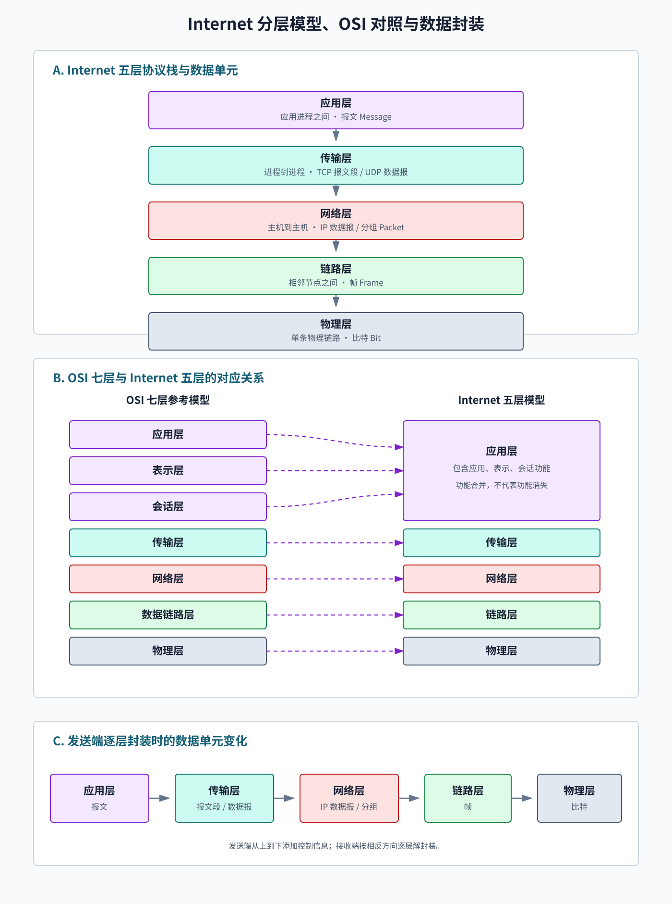
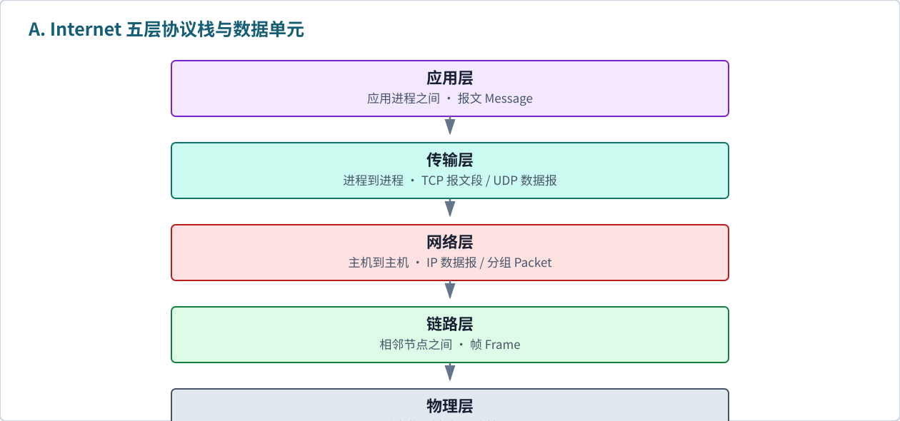
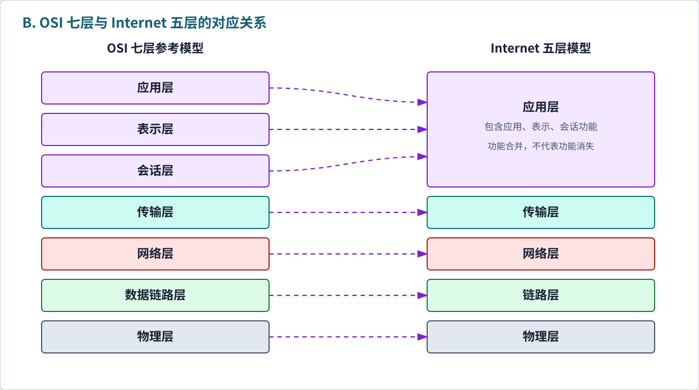
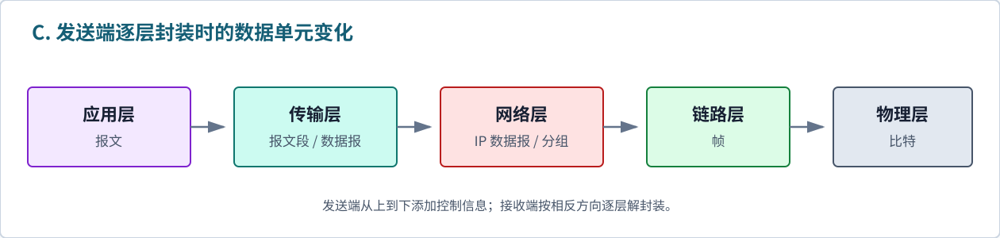

# 第一章 概述

> 颜色标记：<span style="background:#f3e8ff;color:#6b21a8;padding:2px 6px;border-radius:4px;">淡紫色：同类名称</span> <span style="background:#ccfbf1;color:#155e75;padding:2px 6px;border-radius:4px;">淡青色：专有名词</span> <span style="background:#fee2e2;color:#991b1b;padding:2px 6px;border-radius:4px;">淡红色：重点 / 易错</span> <span style="background:#dcfce7;color:#166534;padding:2px 6px;border-radius:4px;">绿色：解释 / 作用</span>

## 1. Internet 与 internet

| 名称                                                                                                | 含义      | 记忆                                                                                                                 |
| ------------------------------------------------------------------------------------------------- | ------- | ------------------------------------------------------------------------------------------------------------------ |
| <span style="background:#f3e8ff;color:#6b21a8;padding:2px 6px;border-radius:4px;">internet</span> | 泛指“互连网” | 多个计算机网络互联形成的网络。                                                                                                    |
| <span style="background:#ccfbf1;color:#155e75;padding:2px 6px;border-radius:4px;">Internet</span> | 特指“因特网” | 全球最大的开放互联网，采用 <span style="background:#ccfbf1;color:#155e75;padding:2px 6px;border-radius:4px;">TCP/IP</span> 协议族。 |

<span style="background:#fee2e2;color:#991b1b;padding:2px 6px;border-radius:4px;">易错</span>：`Internet` 首字母大写时是专有名词；`internet` 小写时是普通概念。

<span style="background:#dcfce7;color:#166534;padding:2px 6px;border-radius:4px;">补充</span>：`TCP/IP` 是协议族名称，不表示所有 Internet 应用都使用 TCP；UDP、ICMP 等也属于 TCP/IP 体系中的协议。

## 2. 计算机网络总体结构

### 2.1 从组成角度定义互联网

<span style="background:#ccfbf1;color:#155e75;padding:2px 6px;border-radius:4px;">互联网（Internet）</span>：由大量<span style="background:#fee2e2;color:#991b1b;padding:2px 6px;border-radius:4px;">端系统、分组交换设备和通信链路</span>构成，并通过各级 ISP 把众多不同规模、不同技术的计算机网络互联起来，统一使用 TCP/IP 协议族进行通信的全球性分组交换网络。

可以概括为：

```text
Internet = 互联的网络 + 端系统 + 通信链路 + 分组交换设备 + 协议
```

- **端系统**负责产生、发送、接收和处理应用数据。
- **通信链路**负责承载比特，包括光纤、双绞线、无线链路等。
- **分组交换设备**负责接收并转发分组，主要包括路由器和链路层交换机。
- **协议**规定通信实体交换报文的格式、顺序和动作，使不同设备能够协同通信。
- **ISP 互联体系**把家庭网、校园网、企业网和运营商网络连接成“网络的网络”。

<span style="background:#fee2e2;color:#991b1b;padding:2px 6px;border-radius:4px;">核心结论</span>：互联网不是一台大型计算机，也不是某一个中心网络，而是<span style="background:#fee2e2;color:#991b1b;padding:2px 6px;border-radius:4px;">大量网络按照共同协议互联形成的网络系统</span>。

### 2.2 按位置和作用分类

从数据传输路径看，互联网可分为三个结构模块：

**图 1-1　计算机网络总体结构**


| 结构模块 | 主要组成 | 位置判断 | 主要作用 |
| --- | --- | --- | --- |
| <span style="background:#f3e8ff;color:#6b21a8;padding:2px 6px;border-radius:4px;">网络边缘</span> | 客户端、服务器、手机、物联网设备等端系统 | 数据传输路径的两端 | <span style="background:#dcfce7;color:#166534;padding:2px 6px;border-radius:4px;">运行网络应用，产生和接收数据</span> |
| <span style="background:#f3e8ff;color:#6b21a8;padding:2px 6px;border-radius:4px;">接入网</span> | 家庭宽带、校园网、企业网、Wi-Fi、蜂窝网络 | 端系统与第一跳路由器之间 | <span style="background:#dcfce7;color:#166534;padding:2px 6px;border-radius:4px;">把端系统接入网络核心</span> |
| <span style="background:#f3e8ff;color:#6b21a8;padding:2px 6px;border-radius:4px;">网络核心</span> | 路由器和高速通信链路 | 位于不同接入网之间 | <span style="background:#dcfce7;color:#166534;padding:2px 6px;border-radius:4px;">选择路径并逐跳转发分组</span> |

判断顺序：先找通信两端的主机，它们属于网络边缘；再找主机到第一跳路由器之间的部分，它属于接入网；其余负责跨网络转发的路由器和链路属于网络核心。

### 2.3 按基本构件分类

| 构件类别 | 回答的问题 | 典型实例 |
| --- | --- | --- |
| <span style="background:#f3e8ff;color:#6b21a8;padding:2px 6px;border-radius:4px;">端系统</span> | 谁产生和接收数据？ | PC、手机、服务器、传感器 |
| <span style="background:#f3e8ff;color:#6b21a8;padding:2px 6px;border-radius:4px;">分组交换设备</span> | 谁把数据转向下一跳？ | 路由器、链路层交换机 |
| <span style="background:#f3e8ff;color:#6b21a8;padding:2px 6px;border-radius:4px;">通信链路</span> | 数据通过什么传播？ | 光纤、双绞线、同轴电缆、无线链路 |
| <span style="background:#f3e8ff;color:#6b21a8;padding:2px 6px;border-radius:4px;">协议</span> | 各组成部分按什么规则通信？ | IP、TCP、UDP、HTTP、Ethernet |

<span style="background:#fee2e2;color:#991b1b;padding:2px 6px;border-radius:4px;">易混</span>：Internet 是通信基础设施；Web（万维网）是运行在 Internet 之上的一种应用。浏览网页只是互联网用途之一，电子邮件、即时通信和文件传输同样可以使用互联网。

## 3. 网络边缘

### 3.1 端系统

<span style="background:#ccfbf1;color:#155e75;padding:2px 6px;border-radius:4px;">端系统（end system / host）</span>：位于网络边缘、运行网络应用的主机。

常见端系统：PC、手机、服务器、平板、联网传感器等。

运行其上的应用进程：Web 浏览器、Web 服务程序、邮件客户端、视频会议程序等。

<span style="background:#fee2e2;color:#991b1b;padding:2px 6px;border-radius:4px;">易混</span>：浏览器是<span style="background:#ccfbf1;color:#155e75;padding:2px 6px;border-radius:4px;">应用程序</span>，运行浏览器的电脑或手机才是<span style="background:#ccfbf1;color:#155e75;padding:2px 6px;border-radius:4px;">端系统</span>。

### 3.2 应用通信模式

| 模式                                                                                                      | 核心特点              | 例子                 |
| ------------------------------------------------------------------------------------------------------- | ----------------- | ------------------ |
| <span style="background:#f3e8ff;color:#6b21a8;padding:2px 6px;border-radius:4px;">客户端-服务器模式（C/S）</span> | 客户端请求，服务器响应       | 浏览器访问网站、邮件服务       |
| <span style="background:#f3e8ff;color:#6b21a8;padding:2px 6px;border-radius:4px;">对等模式（P2P）</span>      | 各端系统既可请求资源，也可提供资源 | BT 下载、eMule、早期文件共享 |

<span style="background:#fee2e2;color:#991b1b;padding:2px 6px;border-radius:4px;">易混</span>：P2P 不是“没有服务器就一定更快”，而是资源分散在多个对等节点上，性能取决于节点数量、上传能力和网络状态。

### 3.3 常见服务器类型

| 类型                                                                                                  | 作用                | 相关协议 / 常见实现       |
| --------------------------------------------------------------------------------------------------- | ----------------- | ----------------- |
| <span style="background:#f3e8ff;color:#6b21a8;padding:2px 6px;border-radius:4px;">Web 服务器</span>    | 提供网页、接口、静态资源      | HTTP；Nginx、Apache |
| <span style="background:#f3e8ff;color:#6b21a8;padding:2px 6px;border-radius:4px;">文件服务器</span>      | 存储和共享文件           | SFTP、SMB、NFS      |
| <span style="background:#f3e8ff;color:#6b21a8;padding:2px 6px;border-radius:4px;">邮件服务器</span>      | 发送、接收、存储邮件        | SMTP；IMAP、POP3    |
| <span style="background:#f3e8ff;color:#6b21a8;padding:2px 6px;border-radius:4px;">DNS 服务器</span>    | 把域名解析为 IP 地址等资源记录 | DNS；BIND、Unbound  |
| <span style="background:#f3e8ff;color:#6b21a8;padding:2px 6px;border-radius:4px;">代理 / 缓存服务器</span> | 转发请求或缓存内容         | Web 代理、CDN 边缘节点   |

<span style="background:#fee2e2;color:#991b1b;padding:2px 6px;border-radius:4px;">易混</span>：“服务器”可指提供服务的<span style="background:#ccfbf1;color:#155e75;padding:2px 6px;border-radius:4px;">进程</span>，也常指运行该进程的<span style="background:#ccfbf1;color:#155e75;padding:2px 6px;border-radius:4px;">主机</span>；协议、软件与设备不是同一个层次。

## 4. 传输服务：TCP 与 UDP

### 4.1 连接、握手与传输

<span style="background:#ccfbf1;color:#155e75;padding:2px 6px;border-radius:4px;">面向连接服务</span>：传输数据前先建立逻辑连接。

简化过程：

1. 建立连接：通信双方先“打招呼”，确认可以通信。
2. 数据传输：发送应用数据。
3. 连接释放：通信结束后释放资源。

<span style="background:#fee2e2;color:#991b1b;padding:2px 6px;border-radius:4px;">易错</span>：TCP 的“连接”是端系统维护的逻辑状态，不等于电路交换中预留一条物理线路，也不会因此预留端到端带宽。

### 4.2 TCP

<span style="background:#ccfbf1;color:#155e75;padding:2px 6px;border-radius:4px;">TCP（Transmission Control Protocol）</span>：面向连接、可靠、按序的字节流传输协议。

<span style="background:#fee2e2;color:#991b1b;padding:2px 6px;border-radius:4px;">核心特征</span>：

- **可靠传输**：通过校验、确认、序号和重传等机制工作。
- **按序交付**：应用层看到的数据顺序正确。
- **流量控制**：防止发送方压垮接收方。
- **拥塞控制**：网络拥堵时降低发送速率。
- **字节流**：TCP 不保留应用层每次发送操作的消息边界。

常用于：传统 Web 访问、文件传输、邮件、远程登录等可靠性优先的应用。

### 4.3 UDP

<span style="background:#ccfbf1;color:#155e75;padding:2px 6px;border-radius:4px;">UDP（User Datagram Protocol）</span>：用户数据报协议。

<span style="background:#fee2e2;color:#991b1b;padding:2px 6px;border-radius:4px;">核心特征</span>：

- 无连接。
- UDP 本身不保证可靠到达或按序到达。
- UDP 本身不提供流量控制和拥塞控制。
- 保留一个个数据报的消息边界。
- 首部固定为 8 B，且 UDP 层无连接建立过程，协议开销较低。

常用于：实时音视频、DNS 查询、在线游戏，以及基于 UDP 自行实现可靠与拥塞控制的协议。

### 4.4 TCP 与 UDP 对比

| 对比项    | TCP         | UDP               |
| ------ | ----------- | ----------------- |
| 连接方式   | 面向连接        | 无连接               |
| 可靠性与顺序 | 协议提供可靠、按序交付 | 协议不提供保证           |
| 数据边界   | 字节流，不保留消息边界 | 数据报，保留消息边界        |
| 控制机制   | 提供流量控制、拥塞控制 | UDP 本身不提供         |
| 典型关注点  | 可靠字节流       | 简单、低协议开销、应用可自定义机制 |

<span style="background:#fee2e2;color:#991b1b;padding:2px 6px;border-radius:4px;">易错</span>：UDP 的协议开销较低，<span style="background:#fee2e2;color:#991b1b;padding:2px 6px;border-radius:4px;">不代表它一定更快或时延一定更低</span>；应用可以按需增加可靠、拥塞控制等机制，也可以选择不增加。

## 5. 网络核心：交换、路由、转发

### 5.1 网络核心

<span style="background:#ccfbf1;color:#155e75;padding:2px 6px;border-radius:4px;">网络核心</span>：由互连的分组交换设备和通信链路构成；在 Internet 语境中主要指路由器及其互连链路。

作用：

- 把分组从源端系统送往目标端系统。
- 根据路径信息进行转发。

### 5.2 电路交换

<span style="background:#ccfbf1;color:#155e75;padding:2px 6px;border-radius:4px;">电路交换（circuit switching）</span>：通信前沿端到端路径预留传输资源，形成逻辑电路。

特点：

- 预留的带宽或时隙由该通信独占，常用频分复用或时分复用实现。
- 电路建立后可获得较稳定的传输速率。
- 电话网是典型例子。

缺点：

- 建立连接需要时间。
- 预留资源即使暂时空闲，也通常不能被其他通信使用，利用率可能较低。
- 一般不适合突发性强的数据通信。

<span style="background:#fee2e2;color:#991b1b;padding:2px 6px;border-radius:4px;">易错</span>：“独占”指独占预留的<span style="background:#ccfbf1;color:#155e75;padding:2px 6px;border-radius:4px;">资源份额</span>，不一定独占一整根物理线路。

### 5.3 分组交换

<span style="background:#ccfbf1;color:#155e75;padding:2px 6px;border-radius:4px;">分组交换（packet switching）</span>：把数据拆成一个个分组，逐跳转发。

过程：

1. 源主机把数据拆成分组。
2. 路由器接收分组，再把它发往下一条链路。
3. 到达目标主机后再交给上层处理。

特点：

- 不预留整条链路。
- 多用户共享网络资源。
- 对突发业务通常有较高的资源利用率。
- 可能排队，产生时延；队列满时可能丢包。

<span style="background:#dcfce7;color:#166534;padding:2px 6px;border-radius:4px;">补充</span>：典型的<span style="background:#ccfbf1;color:#155e75;padding:2px 6px;border-radius:4px;">存储-转发（store-and-forward）</span>要求路由器先接收完整分组，再向下一条链路发送；因此每经过一条链路，至少增加一次“分组长度 ÷ 链路传输速率”的传输时延（暂不计排队等因素）。

### 5.4 电路交换 vs 分组交换

| 对比项    | 电路交换      | 分组交换       |
| ------ | --------- | ---------- |
| 资源     | 预留并独占资源份额 | 按需共享       |
| 连接建立   | 通信前建立     | 通常不为整条路径预留 |
| 适合数据类型 | 持续、稳定数据流  | 突发式数据      |
| 资源利用率  | 对突发业务通常较低 | 对突发业务通常较高  |
| 典型场景   | 传统电话网     | Internet   |

### 5.5 路由与转发

| 概念                                                                                                      | 含义                      | 类比       |
| ------------------------------------------------------------------------------------------------------- | ----------------------- | -------- |
| <span style="background:#ccfbf1;color:#155e75;padding:2px 6px;border-radius:4px;">路由（routing）</span>    | 通过算法或路由协议计算路径，并建立、更新转发表 | 规划路线     |
| <span style="background:#ccfbf1;color:#155e75;padding:2px 6px;border-radius:4px;">转发（forwarding）</span> | 对每个到达分组查转发表，并送到合适的输出端口  | 按路标驶向下一站 |

<span style="background:#fee2e2;color:#991b1b;padding:2px 6px;border-radius:4px;">易混</span>：路由是“算路”；转发是“按表执行”。

## 6. 接入网与物理媒体

### 6.1 接入网

<span style="background:#ccfbf1;color:#155e75;padding:2px 6px;border-radius:4px;">接入网（access network）</span>：连接端系统与其第一跳路由器（边缘路由器）的网络。

常见方式：

- 住宅接入：光纤到户（FTTH）、数字用户线（DSL）、线缆接入（如 HFC）。
- 机构接入：校园网、企业网。
- 无线接入：Wi-Fi、蜂窝网络。

### 6.2 物理媒体

<span style="background:#ccfbf1;color:#155e75;padding:2px 6px;border-radius:4px;">物理媒体（physical media）</span>：传输比特的实际介质。

| 类型                                                                                              | 含义         | 例子           |
| ----------------------------------------------------------------------------------------------- | ---------- | ------------ |
| <span style="background:#f3e8ff;color:#6b21a8;padding:2px 6px;border-radius:4px;">导引型媒体</span>  | 信号沿固体介质传播  | 双绞线、同轴电缆、光纤  |
| <span style="background:#f3e8ff;color:#6b21a8;padding:2px 6px;border-radius:4px;">非导引型媒体</span> | 信号在空气或空间传播 | 无线电波、微波、卫星链路 |

<span style="background:#dcfce7;color:#166534;padding:2px 6px;border-radius:4px;">补充</span>：光纤抗干扰能力强、传输距离远、带宽高，是骨干网常用介质。

## 7. 互联网结构：网络的网络

### 7.1 基本结构

<span style="background:#ccfbf1;color:#155e75;padding:2px 6px;border-radius:4px;">Internet</span> 本质上是“网络的网络”。

基本关系：

```text
端系统 -> 接入网 / 接入 ISP
       -> 一个或多个 ISP、IXP 或内容提供商网络
       -> 目标接入网 -> 目标端系统
```

<span style="background:#dcfce7;color:#166534;padding:2px 6px;border-radius:4px;">说明</span>：上式只是教学用简化路径。真实流量还可能经过对等互联、互联网交换点（IXP）或内容提供商网络，并不固定逐层经过每一级 ISP。

关键点：

- 端系统通过接入 ISP 连接到互联网。
- 在地址可达、路由存在且安全策略允许时，不同网络中的端系统可以相互交换分组。
- 互联网结构复杂，不是“一台中心服务器”控制所有通信。

### 7.2 ISP 分层

<span style="background:#ccfbf1;color:#155e75;padding:2px 6px;border-radius:4px;">ISP（Internet Service Provider）</span>：互联网服务提供商。

| 层级                                                                                                  | 含义            | 特点                                       |
| --------------------------------------------------------------------------------------------------- | ------------- | ---------------------------------------- |
| <span style="background:#f3e8ff;color:#6b21a8;padding:2px 6px;border-radius:4px;">Tier 1 ISP</span> | 全球级骨干网络       | 通常无需购买 IP 转接服务，借助无结算对等互联即可到达全球 Internet。 |
| <span style="background:#f3e8ff;color:#6b21a8;padding:2px 6px;border-radius:4px;">Tier 2 ISP</span> | 区域级 / 国家级 ISP | 部分对等互联，部分向 Tier 1 购买转接服务。                |
| <span style="background:#f3e8ff;color:#6b21a8;padding:2px 6px;border-radius:4px;">Tier 3 ISP</span> | 本地 / 接入 ISP   | 直接服务家庭和企业用户。                             |

国内例子：中国移动、中国联通、中国电信等运营商会建设和维护主干网、城域网和接入网。

<span style="background:#fee2e2;color:#991b1b;padding:2px 6px;border-radius:4px;">注意</span>：Tier 1/2/3 是便于理解的简化分类，现实互联网不是严格的树形三级结构。

### 7.3 关于 IP 地址的补充

<span style="background:#fee2e2;color:#991b1b;padding:2px 6px;border-radius:4px;">纠错</span>：“核心网络通常有多个 IP 地址，家用一般是两个 IP 地址”不能作为通用结论。更准确的理解是：

- IP 地址通常配置给网络接口；一个路由器可有多个接口，一个接口也可能同时拥有多个 IPv4/IPv6 地址。
- 家庭路由器常见有运营商侧（WAN）地址和局域网侧（LAN）地址，但实际数量取决于接口、IPv4/IPv6 与运营商配置。
- 家中多台设备常通过 <span style="background:#ccfbf1;color:#155e75;padding:2px 6px;border-radius:4px;">NAT</span> 共享对外访问能力。

## 8. 时延、丢包与吞吐量

### 8.1 四类时延

**图 1-2　结点总时延的四个组成部分**


| 时延类型                                                                                          | 含义                       | 重点                                                                                                      |
| --------------------------------------------------------------------------------------------- | ------------------------ | ------------------------------------------------------------------------------------------------------- |
| <span style="background:#f3e8ff;color:#6b21a8;padding:2px 6px;border-radius:4px;">处理时延</span> | 路由器检查分组首部、检查差错、决定输出端口的时间 | 通常较小                                                                                                    |
| <span style="background:#f3e8ff;color:#6b21a8;padding:2px 6px;border-radius:4px;">排队时延</span> | 分组在输出队列等待发送的时间           | <span style="background:#fee2e2;color:#991b1b;padding:2px 6px;border-radius:4px;">原笔记遗漏项；随拥塞程度变化</span> |
| <span style="background:#f3e8ff;color:#6b21a8;padding:2px 6px;border-radius:4px;">传输时延</span> | 把整个分组推入链路所需时间            | 与分组长度、链路速率有关                                                                                            |
| <span style="background:#f3e8ff;color:#6b21a8;padding:2px 6px;border-radius:4px;">传播时延</span> | 信号在物理介质中传播的时间            | 与距离、传播速度有关                                                                                              |

公式：

```text
结点总时延 = 处理时延 + 排队时延 + 传输时延 + 传播时延

传输时延 = 分组长度 ÷ 链路传输速率
传播时延 = 链路长度 ÷ 信号传播速度
```

教材常用符号对照：

| 中文变量 | 常用符号 | 单位 |
| --- | --- | --- |
| 分组长度 | `L` | `bit` |
| 链路传输速率 | `R` | `bit/s` |
| 链路长度 | `D` | `m` |
| 信号传播速度 | `v` | `m/s` |

- 四个分量统一换算为秒（`s`）后才能相加。

<span style="background:#fee2e2;color:#991b1b;padding:2px 6px;border-radius:4px;">易混</span>：

- 传输时延由“分组长度 ÷ 链路传输速率”决定，与链路物理长度无直接关系。
- 传播时延由“链路长度 ÷ 信号传播速度”决定，与分组长度、链路传输速率无直接关系。

<span style="background:#dcfce7;color:#166534;padding:2px 6px;border-radius:4px;">补充</span>：排队时延最不稳定；队列为空时可接近 0，流量接近或超过链路处理能力时会迅速增大。

端到端总时延需要把沿途各节点和链路产生的时延相加；上式描述的是一个节点及其输出链路上的基本组成。

### 8.2 分组丢失

<span style="background:#ccfbf1;color:#155e75;padding:2px 6px;border-radius:4px;">分组丢失（packet loss）</span>：分组在传输途中被丢弃，未能交付到目标。

常见原因：

- 网络拥塞使路由器缓冲区（队列）已满，新到分组被丢弃。
- 传输差错、链路或设备故障等异常也可能造成丢失。

### 8.3 吞吐量

<span style="background:#ccfbf1;color:#155e75;padding:2px 6px;border-radius:4px;">吞吐量（throughput）</span>：单位时间内从源端系统传到目标端系统的数据量。

分类：

- <span style="background:#f3e8ff;color:#6b21a8;padding:2px 6px;border-radius:4px;">瞬时吞吐量</span>：某一时刻的传输速率。
- <span style="background:#f3e8ff;color:#6b21a8;padding:2px 6px;border-radius:4px;">平均吞吐量</span>：一段时间内成功传送的数据量 `F` 除以所用时间 `T`，即 `F/T`。

吞吐量常用单位为 `bit/s`，注意不要与字节 `B` 混淆：`1 B = 8 bit`。

瓶颈链路：

```text
Throughput_end ≤ min(R1, R2, R3, ...)
```

<span style="background:#dcfce7;color:#166534;padding:2px 6px;border-radius:4px;">适用条件</span>：对于持续的单个数据流，在无其他竞争流量且无其他瓶颈的理想稳态模型中，才可近似取等号。实际吞吐量还受共享链路上的其他流量、协议开销和端系统处理能力限制。

<span style="background:#fee2e2;color:#991b1b;padding:2px 6px;border-radius:4px;">易错</span>：瓶颈链路给出的是端到端吞吐量的上限约束，不代表任何时刻都能达到该速率。

## 9. 协议层次、服务与协议

### 9.1 为什么要分层

<span style="background:#ccfbf1;color:#155e75;padding:2px 6px;border-radius:4px;">协议层次</span>：把复杂网络功能拆成多个层次。

### 9.2 服务、原语、服务访问点

| 概念                                                                                                               | 含义                      |
| ---------------------------------------------------------------------------------------------------------------- | ----------------------- |
| <span style="background:#ccfbf1;color:#155e75;padding:2px 6px;border-radius:4px;">服务（service）</span>             | 下层向上层提供的功能。             |
| <span style="background:#ccfbf1;color:#155e75;padding:2px 6px;border-radius:4px;">服务原语（service primitive）</span> | 服务用户与服务提供者跨层交互的抽象操作或事件。 |
| <span style="background:#ccfbf1;color:#155e75;padding:2px 6px;border-radius:4px;">服务访问点（SAP）</span>              | 上层访问下层服务的逻辑接口或地址点。      |

<span style="background:#dcfce7;color:#166534;padding:2px 6px;border-radius:4px;">简化理解</span>：服务是“能做什么”，原语是“怎么调用”，SAP 是“从哪里调用”。

常见服务原语名称有 `request`、`indication`、`response`、`confirm`；具体课程若采用其他分类，以教师和教材口径为准。

### 9.3 服务与协议的区别

<span style="background:#ccfbf1;color:#155e75;padding:2px 6px;border-radius:4px;">协议（protocol）</span>：规定对等实体交换报文的格式、次序，以及发送或接收报文时采取的动作。

| 对比项   | 服务           | 协议             |
| ----- | ------------ | -------------- |
| 关系    | 同一系统中相邻上下层之间 | 不同系统中的同层对等实体之间 |
| 回答的问题 | 下层向上层提供什么能力  | 对等实体按什么规则通信    |
| 可见性   | 服务接口对上层可见    | 协议细节通常对上层不可见   |

<span style="background:#fee2e2;color:#991b1b;padding:2px 6px;border-radius:4px;">易错</span>：服务是“垂直关系”，协议是“水平关系”。

<span style="background:#dcfce7;color:#166534;padding:2px 6px;border-radius:4px;">联系</span>：同层实体执行协议，共同实现该层向上一层承诺的服务；更换协议实现时，只要服务接口与语义不变，上层通常无需感知内部变化。

## 10. 数据单元 DU

<span style="background:#ccfbf1;color:#155e75;padding:2px 6px;border-radius:4px;">DU（Data Unit）</span>：数据单元的统称；分层语境中更常见的术语是 <span style="background:#ccfbf1;color:#155e75;padding:2px 6px;border-radius:4px;">PDU（Protocol Data Unit，协议数据单元）</span> 和 <span style="background:#ccfbf1;color:#155e75;padding:2px 6px;border-radius:4px;">SDU（Service Data Unit，服务数据单元）</span>。

- 上层交给本层的数据，在本层看来是 SDU。
- 本层为 SDU 添加控制信息后形成 PDU，再交给下层。

| 层次  | 数据单元        | 英文                 |
| --- | ----------- | ------------------ |
| 应用层 | 报文          | message            |
| 传输层 | 报文段 / 用户数据报 | segment / datagram |
| 网络层 | 分组 / 数据报    | packet / datagram  |
| 链路层 | 帧           | frame              |
| 物理层 | 位           | bit                |

封装过程（`H` 表示首部，`T` 表示尾部）：

```text
应用层：                   [      message      ]
传输层：              [H_T][      message      ]  -> TCP segment / UDP datagram
网络层：          [H_N][H_T][      message      ]  -> IP datagram
链路层：      [H_L][H_N][H_T][      message      ][T_L] -> frame
物理层：      把整个帧编码为 bit 流发送
```

接收端按相反方向逐层检查并去除相应控制信息，这一过程称为<span style="background:#ccfbf1;color:#155e75;padding:2px 6px;border-radius:4px;">解封装（decapsulation）</span>。

<span style="background:#fee2e2;color:#991b1b;padding:2px 6px;border-radius:4px;">易混</span>：并非每层只是给同一份数据“改名”，而是逐层封装；不同教材对 `packet`、`datagram` 的用法可能略有差异，考试时优先按老师课堂定义来写。

## 11. Internet 协议栈

**图 1-3　Internet 分层模型、OSI 对照与数据封装综合图**



### 11.1 分层思想

**图 1-3A　Internet 五层协议栈与数据单元**



<span style="background:#ccfbf1;color:#155e75;padding:2px 6px;border-radius:4px;">Internet 五层协议栈</span>：把复杂的网络通信任务分为应用层、传输层、网络层、链路层和物理层，各层使用下层服务并向上层提供服务。

<span style="background:#dcfce7;color:#166534;padding:2px 6px;border-radius:4px;">作用</span>：每层只处理一类核心问题，便于协议独立设计、替换、实现和排错。

| 层次                                                                                           | 数据单元                                | 核心通信范围 | 主要任务                  | 典型协议 / 技术                |
| -------------------------------------------------------------------------------------------- | ----------------------------------- | ------ | --------------------- | ------------------------ |
| <span style="background:#f3e8ff;color:#6b21a8;padding:2px 6px;border-radius:4px;">应用层</span> | 报文（message）                         | 应用进程之间 | 提供具体网络应用服务            | HTTP、FTP、SMTP、DNS        |
| <span style="background:#f3e8ff;color:#6b21a8;padding:2px 6px;border-radius:4px;">传输层</span> | TCP 报文段（segment）/ UDP 数据报（datagram） | 进程到进程  | 复用与分用；按协议提供可靠或尽力而为的传输 | TCP、UDP                  |
| <span style="background:#f3e8ff;color:#6b21a8;padding:2px 6px;border-radius:4px;">网络层</span> | IP 数据报 / 分组（packet，常口语称“包”）         | 主机到主机  | 寻址、路由选择与分组转发          | IP、ICMP、路由协议             |
| <span style="background:#f3e8ff;color:#6b21a8;padding:2px 6px;border-radius:4px;">链路层</span> | 帧（frame）                            | 相邻节点之间 | 在一段链路上传送帧             | Ethernet、IEEE 802.11、PPP |
| <span style="background:#f3e8ff;color:#6b21a8;padding:2px 6px;border-radius:4px;">物理层</span> | 比特（bit）                             | 单条物理链路 | 把比特转换为电、光或无线信号        | 双绞线、光纤、无线电               |

<span style="background:#fee2e2;color:#991b1b;padding:2px 6px;border-radius:4px;">易混</span>：日常常把网络层数据称为“包”，教材中更严谨的名称通常是<span style="background:#ccfbf1;color:#155e75;padding:2px 6px;border-radius:4px;">IP 数据报或分组</span>；传输层名称还要区分 TCP 报文段与 UDP 数据报。

### 11.2 OSI 七层模型与 Internet 五层模型

<span style="background:#ccfbf1;color:#155e75;padding:2px 6px;border-radius:4px;">OSI 七层模型</span>是国际标准化组织提出的<span style="background:#dcfce7;color:#166534;padding:2px 6px;border-radius:4px;">概念性参考模型</span>；实际 Internet 主要采用 TCP/IP 协议体系，教学中通常把它表示为四层或五层模型。

**图 1-3B　OSI 七层与 Internet 五层的对应关系**



OSI 的应用层、表示层和会话层被明确分成三个方框，再共同对应 Internet 应用层。

| OSI 层次                                                                                       | 主要功能              | 在 Internet 五层模型中的位置 |
| -------------------------------------------------------------------------------------------- | ----------------- | ------------------- |
| 应用层                                                                                          | 为用户应用提供网络服务       | 应用层                 |
| <span style="background:#f3e8ff;color:#6b21a8;padding:2px 6px;border-radius:4px;">表示层</span> | 数据格式转换、编码、压缩、加密等  | 通常由应用层协议、应用程序或相关库实现 |
| <span style="background:#f3e8ff;color:#6b21a8;padding:2px 6px;border-radius:4px;">会话层</span> | 建立、管理和恢复应用会话、对话同步 | 通常由应用层协议或应用程序实现     |
| 传输层                                                                                          | 进程到进程传输           | 传输层                 |
| 网络层                                                                                          | 主机到主机交付、路由与转发     | 网络层                 |
| 数据链路层                                                                                        | 相邻节点间的帧传输         | 链路层                 |
| 物理层                                                                                          | 在线路上传送比特          | 物理层                 |

<span style="background:#fee2e2;color:#991b1b;padding:2px 6px;border-radius:4px;">核心重点</span>：Internet 协议栈<span style="background:#fee2e2;color:#991b1b;padding:2px 6px;border-radius:4px;">没有单独设置表示层和会话层</span>，而是把这两层的功能并入应用层。层次被合并不表示相关功能消失。

- 表示层功能示例：字符编码、JSON 数据格式、图片压缩、加密与解密。
- 会话层功能示例：登录状态、会话标识、断点恢复、对话同步。

<span style="background:#fee2e2;color:#991b1b;padding:2px 6px;border-radius:4px;">易错</span>：OSI 七层模型主要用于理解、设计和描述网络功能，不能把它当成 Internet 实际部署的一套完整协议栈；实际协议的功能边界也不一定严格对应某一个 OSI 层。

### 11.3 应用层

<span style="background:#ccfbf1;color:#155e75;padding:2px 6px;border-radius:4px;">应用层（application layer）</span>：为用户或其他应用进程提供网络应用服务，并规定应用进程交换报文的规则。

| 协议   | 主要用途        |
| ---- | ----------- |
| HTTP | Web 资源与接口访问 |
| FTP  | 文件传输        |
| SMTP | 邮件发送与转发     |
| DNS  | 域名及其他资源记录查询 |

<span style="background:#fee2e2;color:#991b1b;padding:2px 6px;border-radius:4px;">易错</span>：DNS 不只是“把域名变成 IP”，它还能查询邮件服务器、别名等多种资源记录。

### 11.4 传输层

<span style="background:#ccfbf1;color:#155e75;padding:2px 6px;border-radius:4px;">传输层（transport layer）</span>：建立在网络层主机到主机交付的基础上，通过端口号把数据交给正确的应用进程，实现<span style="background:#fee2e2;color:#991b1b;padding:2px 6px;border-radius:4px;">进程到进程</span>的通信。

- TCP：面向连接，提供可靠、按序的字节流，并具有流量控制和拥塞控制。
- UDP：无连接，保留数据报边界，但自身不保证可靠到达、顺序、流量控制或拥塞控制。

<span style="background:#fee2e2;color:#991b1b;padding:2px 6px;border-radius:4px;">[纠错 / 易混]</span>：课件标题写“传输层：主机之间的数据传输”是简化说法。严格区分时，网络层负责主机到主机，传输层进一步负责进程到进程；TCP 可以把不可靠的 IP 服务构造成对应用而言可靠的传输服务，UDP 则不提供这种可靠性保证。

### 11.5 网络层

<span style="background:#ccfbf1;color:#155e75;padding:2px 6px;border-radius:4px;">网络层（network layer）</span>：负责把分组从源主机送往目的主机，核心功能是寻址、路由选择和逐跳转发。

- IP 提供<span style="background:#fee2e2;color:#991b1b;padding:2px 6px;border-radius:4px;">尽力而为（best effort）</span>的无连接服务。
- IP 本身不保证交付、不保证按序，也不保证固定时延或带宽。
- 路由协议负责形成路径信息；路由器依据转发表执行转发。

<span style="background:#fee2e2;color:#991b1b;padding:2px 6px;border-radius:4px;">易混</span>：网络层的“端到端”通常指源主机到目的主机，不等于传输层应用进程之间的端到端服务。

### 11.6 链路层

<span style="background:#ccfbf1;color:#155e75;padding:2px 6px;border-radius:4px;">链路层（link layer）</span>：负责在同一条链路相连的相邻网络节点之间传送帧。

- 点到点链路：一条链路连接两个节点，例如 PPP 链路。
- 广播式链路：多个节点共享传输介质，例如典型以太网或 Wi-Fi 网络。
- 典型技术：PPP、Ethernet（以太网）、IEEE 802.11（Wi-Fi）。

<span style="background:#fee2e2;color:#991b1b;padding:2px 6px;border-radius:4px;">易错</span>：链路层是否可靠取决于具体协议和使用场景，不能笼统地说“链路层一定可靠”或“一定不可靠”；而且链路层只负责一跳，不负责完整的端到端路径。

### 11.7 物理层

<span style="background:#ccfbf1;color:#155e75;padding:2px 6px;border-radius:4px;">物理层（physical layer）</span>：规定怎样在物理介质上传送一个个比特，包括信号形式、编码、接口和传输速率等。

<span style="background:#dcfce7;color:#166534;padding:2px 6px;border-radius:4px;">理解</span>：物理层关心“0 和 1 怎样变成信号并在线路上传输”，不理解 HTTP 报文、IP 地址或端口号的语义。

### 11.8 封装与解封装

发送端从上到下逐层添加控制信息，接收端从下到上逐层去除并解析控制信息。

**图 1-3C　发送端逐层封装时的数据单元变化**



图中各层之间保留了独立间距，依次表示报文、报文段或数据报、IP 数据报或分组、帧和比特。

<span style="background:#fee2e2;color:#991b1b;padding:2px 6px;border-radius:4px;">易混</span>：数据不是经过每层后只“换名字”；发送端通常还会添加该层首部，链路层还可能添加尾部。
